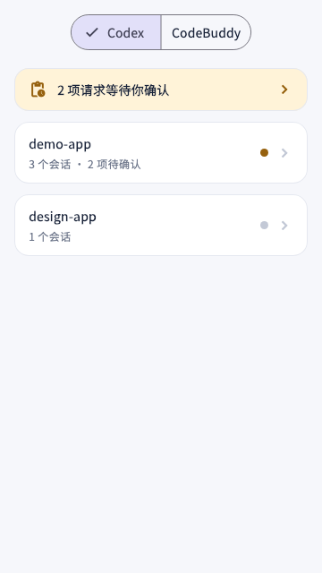
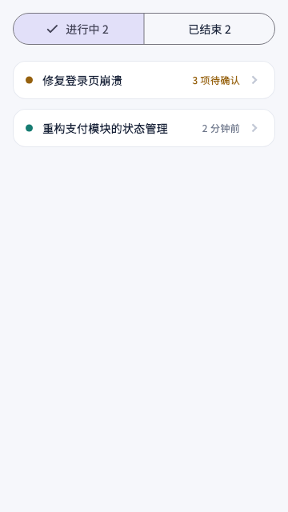
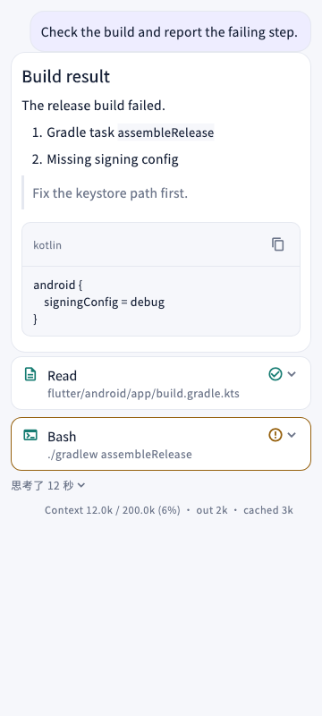

# AgentLink

Drive **Codex** and **CodeBuddy** sessions running on your computer from an Android phone: browse historical projects, read conversations, approve pending actions, and switch permission modes on the fly.

[中文](README.md) · **English**

The repository contains both the desktop-side scheduling service and the Android client.

> **Built on [tiann/hapi](https://github.com/tiann/hapi)**, under the same AGPL-3.0 license.
> The Hub, the Runner, the cross-platform protocol, and the Web client come from upstream.
> AgentLink adds an Android client, CodeBuddy support, a public Host, and usage/quota reporting
> on top. See [Relationship to upstream hapi](#relationship-to-upstream-hapi).

## Architecture

```
┌─────────────────┐        ┌──────────────┐        ┌──────────────────────┐
│  Flutter App    │  ⇄     │     Hub      │  ⇄     │   Runner (macOS)     │
│  (Android)      │        │              │        │                      │
│  · Projects     │        │  · Sessions  │        │  ┌────────────────┐  │
│  · Transcripts  │        │  · Perms     │        │  │ codex          │  │
│  · Approvals    │        │  · Pairing   │        │  │ codebuddy --acp│  │
│  · Permission   │        │              │        │  └────────────────┘  │
└─────────────────┘        └──────────────┘        └──────────────────────┘
```

In LAN mode, `scripts/dev/agentlink-host.mjs` brings up the Hub, the Runner, and an admin page together:

| Service | Default port | Purpose |
| --- | --- | --- |
| Hub | `3106` | REST API and session sync |
| Device TLS | `3107` | Pinned-fingerprint device connections |
| LAN discovery | `3108` (UDP) | Broadcast to find the computer |
| Local admin page | `3109` | Bound to `127.0.0.1`; verify the pairing digits and revoke devices |

## Screens

| Projects | Sessions | Transcript |
| :---: | :---: | :---: |
|  |  |  |

All three are **rendered from demo data** (render snapshots under `flutter/test/goldens/`), so they contain no real project names or paths and cannot drift out of date — re-run `flutter test --update-goldens` after a UI change to refresh them. The third one shows Markdown and code blocks, tool cards, a reasoning line, and the token-usage status line at the bottom.

## Layout

| Directory | Contents |
| --- | --- |
| `flutter/` | **The Android client for this project** (Dart) — the actual deliverable |
| `cli/` | Runner and per-agent adapters, including `cli/src/codebuddy/` |
| `hub/` | Session sync hub and HTTP routes |
| `shared/` | Cross-platform protocol, schemas, and permission-mode definitions |
| `web/` | Web client |
| `scripts/dev/` | LAN / public Host, device wiring, and smoke scripts |
| `design/agentlink/` | UI design notes and the Figma link |
| `docs/` | Architecture, Host guides, and per-milestone acceptance records |
| `artifacts/` | Locally built APKs — **not tracked** |

The directories below come from upstream hapi and are **not used by this project**. They account for most of the files in the repo (roughly 300 Kotlin and 300 Swift files), which is easy to misread on a first pass:

| Directory | Contents |
| --- | --- |
| `android/` | Upstream Kotlin Android client, unrelated to this project's `flutter/` |
| `ios/` | Upstream Swift iOS client |
| `relay/` | Upstream official relay service (the `relay.hapi.run` setup) |
| `e2e/` | Upstream Playwright end-to-end specs |

## Relationship to upstream hapi

Upstream [hapi](https://github.com/tiann/hapi) answers "drive Codex sessions from a browser". AgentLink extends that to the phone and fills in pieces upstream does not have. Knowing which side a change belongs to matters for downstream work:

**From upstream**: Hub session sync and permission routing, the Runner, ACP / Codex adapters, the cross-platform protocol (`shared/`), and the Web client (`web/`).

**Added or substantially changed here**:

| Area | What | Where |
| --- | --- | --- |
| Android client | Upstream ships iOS and Web only; projects, sessions, transcripts, approvals, permission modes, model switching, usage and quota all live here | `flutter/` |
| CodeBuddy support | Built on its ACP protocol, with 8 permission modes and runtime model switching. **No Octop code was copied** | `cli/src/codebuddy/` |
| Public Host | Cloudflare tunnel instead of the official relay, with one command to start it and print the pairing QR | `scripts/dev/agentlink-public.mjs` |
| Usage & quota | Hub-side usage summary (local spend vs. imported history) and end-to-end Codex account quota reporting | `hub/src/sync/usageService.ts` |
| Session resume | Imported historical sessions have no process on the computer; sending a message resumes them automatically | `flutter/lib/app_model.dart` |

## Requirements

| | Requirement |
| --- | --- |
| Computer | **macOS** — the Runner is currently macOS-only |
| Runtime | [Bun](https://bun.sh) 1.4+ (`启动局域网连接.command` looks for it automatically) |
| Logged-in CLIs | `codex` and `codebuddy` — the Hub drives sessions through their app-server / ACP interfaces |
| Phone | Android 7.0 (API 24) or newer |
| To build the client | Flutter (Dart SDK 3.11.5+) |

## Quick start

### Desktop

Install Bun if needed:

```bash
curl -fsSL https://bun.sh/install | bash    # or: npm install -g bun
```

Then **double-click `启动局域网连接.command`** and leave the terminal window open. The first run prints a pairing QR code and the admin page address.

To start it manually:

```bash
HAPI_BUN_BIN="$HOME/.local/bin/bun" node scripts/dev/agentlink-host.mjs --lan
```

### Phone

To skip building, grab the APK from [Releases](https://github.com/luobeibei0710/agentlink/releases) (Android 7.0+). To build it yourself:

```bash
cd flutter
flutter pub get
flutter build apk --release
# Output: build/app/outputs/flutter-apk/app-release.apk
```

After installing:

1. Put the phone and the computer on the **same Wi-Fi**;
2. Open the app → "Scan or connect manually" → scan the QR code on the computer;
3. Confirm the 8-digit code on the desktop admin page the first time.

## Features

**Browsing** — a two-level drill-down: `project → session → transcript`. The workspace lists project names and status dots only; each session row keeps just the title, status, and relative time.

**Transcripts** — Markdown (fenced code blocks with language labels and copy), tool cards with expandable input/output, ChatGPT-style reasoning lines (a single grey line by default, tap to expand), and a token-usage status line that matches the Web client.

**Session interaction** — imported historical sessions have no process on the computer, so you **don't need to tap "Resume" first**: type and send, and the session is resumed before delivery. While it starts, the button spins, the header shows "Starting…", and polling temporarily drops from 2s to 600ms. If resuming fails the message is not sent, so it can't land on an archived session.

**Approvals** — pending actions are rendered per tool type (commands get the command line and working directory, writes get paths and changed-line counts) instead of dumping raw JSON. Destructive fragments such as `rm -rf`, `sudo`, and `git push --force` raise an explicit warning; new requests pop up a confirmation sheet with the command details collapsed by default.

**Usage & quota** — the top-bar Usage entry splits **local spend** from **imported history** across `7 days / 30 days / all` (the two use different accounting and are deliberately not summed), and shows the **Codex account quota**: plan, per-window usage, and reset time. Quota arrives piggybacked on the message stream — no extra polling.

**Public access** — besides LAN, a Cloudflare tunnel can expose the computer to the internet so the phone works off the same Wi-Fi. See [docs/public-host.md](docs/public-host.md).

**Permission modes** — filtered per agent and **applied live while a session runs** (no agent restart):

| Agent | Modes |
| --- | --- |
| Codex | Default / Read-only / Safe auto / Full auto |
| CodeBuddy | Default / Accept edits / Plan / Auto / Don't ask / Bypass permissions / Full access / Delegate |
| Claude / Cursor / Copilot | See `shared/src/modes.ts` |

The modes shown are the **real values reported by the computer** (`SessionSummary.permissionMode`), not something the phone guesses.

**Model switching** — switch models inside a session. The list also comes from the computer (an RPC call for Codex, the session's ACP config options for CodeBuddy), so there are no phantom entries you can't actually select.

## Known limitations

- **UDP auto-discovery fails on some routers and devices** — the symptom is an empty "nearby computers" list. Use QR pairing; that always works.
- **The random domain of a Cloudflare quick tunnel takes a while to resolve on Chinese DNS** — for the first ten minutes to an hour it may not resolve, and the record is withdrawn as soon as the tunnel stops. Use a named domain for anything long-lived; see [docs/public-host.md](docs/public-host.md).
- **Quota only covers Codex** — CodeBuddy's ACP protocol does not report quota, and its `/v2/billing/*` endpoints are not implemented here.
- **No background push.** The app syncs every 2 seconds while in the foreground; nothing arrives when it is backgrounded.
- **CodeBuddy IDE transcript bodies are unavailable** — they live in the cloud, and only pointers exist locally. IDE projects appear as project groups, but only CodeBuddy CLI sessions have transcript bodies.
- **Android only.**
- Diff views and Mermaid / KaTeX rendering are not yet on par with the Web client.

## FAQ

**The phone can't find my computer** — auto-discovery uses UDP broadcast, which some routers or devices block. Switch to QR pairing.

**Paired but can't connect** — the Hub on the computer must keep running (don't close the terminal). In LAN mode both devices must be on the same Wi-Fi and the router must not have AP isolation enabled.

**The public URL opens on my phone but not on my computer** — that's not a misconfiguration. The random domain of a Cloudflare quick tunnel takes ten minutes to an hour to propagate on Chinese DNS; phones on carrier DNS are usually unaffected. See [docs/public-host.md](docs/public-host.md).

**No quota is shown** — quota only exists for Codex, and only after the Hub has seen a session that carried it. It arrives on the message stream; it does not appear out of nowhere.

**Can I just send a message in a historical session?** — Yes. Imported sessions have no process on the computer; sending resumes them automatically, so there is no need to tap "Resume" first.

## Version

The current client is **1.12.1** (`versionCode 16`), taken from the `version` field in `flutter/pubspec.yaml` — you don't need to pass `--build-name`:

```bash
cd flutter && flutter build apk --release   # → 1.12.1+16
```

**Releases are automated**: pushing a `v*` tag triggers [`.github/workflows/android-release.yml`](.github/workflows/android-release.yml) — it verifies the tag matches the pubspec version, builds the APK, generates `SHA256SUMS.txt`, and attaches both to a release with the same name. You can also re-publish a tag manually from the Actions page. Signing key setup is in [CONTRIBUTING.md](CONTRIBUTING.md#发布与签名).

The `0.30.3` in `shared/src/buildInfo.ts` is the **upstream hapi version number**, used to locate the runtime directory under `~/.agentlink/runtime/<version>` — **do not bump it alongside the client**, or the downloaded runtime will not be found.

The `*-validation.md` files under `docs/` are per-milestone acceptance records numbered as of their time; they are not backfilled to the current client version.

## Development

```bash
# Phone
cd flutter
flutter analyze
flutter test                    # includes render snapshots, see test/goldens/

# Desktop
bun run typecheck
bun run test:hub
bun run test:web
bun run test:shared
cd cli && ./node_modules/.bin/vitest run
```

Render snapshots cover transcripts, project lists, session lists, the pairing page, the devices page, and approval cards. Confirm that a diff is expected before updating them:

```bash
flutter test --update-goldens
```

See [CONTRIBUTING.md](CONTRIBUTING.md) for the full pre-commit checklist and the pitfalls worth knowing (idempotent migrations, the fixture drift gate, keeping the three rendering surfaces in sync).

## Docs

| Document | Contents |
| --- | --- |
| [docs/agentlink-flutter.md](docs/agentlink-flutter.md) | Client architecture, rendering alignment, UI information architecture, permission modes, approval cards |
| [docs/agentlink-validation.md](docs/agentlink-validation.md) | 1.0.0 live integration record |
| [docs/agentlink-ui-validation.md](docs/agentlink-ui-validation.md) | 1.1.0 UI redesign acceptance |
| [docs/agentlink-device-validation.md](docs/agentlink-device-validation.md) | 1.3.0 device acceptance checklist |
| [docs/agentlink-lan-validation.md](docs/agentlink-lan-validation.md) | LAN mode validation |
| [docs/lan-host.md](docs/lan-host.md) | Desktop LAN Host guide |
| [docs/public-host.md](docs/public-host.md) | Public access: Cloudflare tunnel, named domains, and the known DNS propagation issue |
| [CONTRIBUTING.md](CONTRIBUTING.md) | Development setup, pre-commit checks, and conventions |

## Origin and license

Based on [tiann/hapi](https://github.com/tiann/hapi), under the repository's [AGPL-3.0](LICENSE) license.

AGPL-3.0 is copyleft: if you distribute a modified version — **including making it available as a network service** — you must also provide the corresponding source and license notices. CodeBuddy support is an independent implementation of its ACP protocol; no Octop source code was copied.
